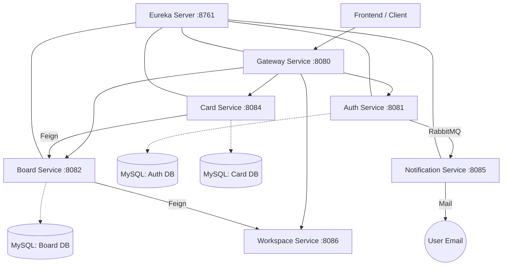

# FlowBoard Backend - Microservices Architecture

This project is a Trello-like project management tool built with Spring Boot Microservices.

## 🏗️ Architecture Diagram



## 🛠️ Mandatory Requirements Implementation

### 1. Security & Microservices
- **JWT**: Implemented in `auth-service` and validated at `gateway-service`.
- **Discovery**: Eureka Server for service registration.

### 2. Messaging (RabbitMQ)
- Used for sending asynchronous notifications (OTP, Welcome Email) to decouple `auth-service` from email delivery.

### 3. Payment Integration
- **RazorPay**: Integrated in `payment-service` for PRO membership upgrades.

### 4. Code Quality & Coverage
- **Jacoco**: Integrated for Unit Test coverage.
- **SonarQube**: Configured in root `pom.xml` for static code analysis.
- **Goal**: > 80% coverage.

### 5. API Documentation
- **Swagger/OpenAPI**: Available at `/swagger-ui.html` for each service.

## 🚀 How to Run Analysis

To generate code coverage and run SonarQube analysis:
```bash
mvn clean verify sonar:sonar -Dsonar.login=YOUR_SONAR_TOKEN
```
